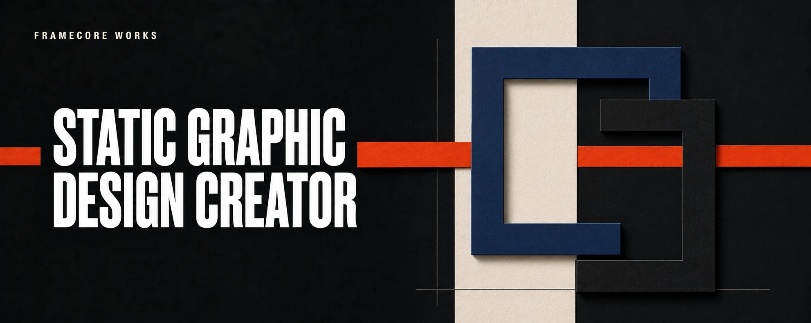

# Static Graphic Design Creator

**Static Graphic Design Creator is a standalone native Skill source for ChatGPT Work and Codex.** It helps turn a brief into either a finished static graphic, when rendering is explicitly requested, or one controlled, generator-ready prompt for posters, flyers, business cards, menus, covers, labels, key visuals, advertisements, and text-led social graphics.

It behaves like a graphic designer, not a style-prompt dispenser: objective and audience response come first; then visual thesis, hierarchy, composition, type/image roles, style language, and material treatment. The final prompt is one integrated, eight-stage construction sequence inside a single generation. It is not a request for separate renders, blank text zones, or manual layer assembly.

## Install from this repository

### ChatGPT Work

Native Skills must be available in the active account and workspace. Work access alone does not guarantee that Skills or `@skill-creator` are available. If the Skills surface is absent, use an eligible workspace or Codex instead; do not simulate a successful installation. OpenAI lists Skills for eligible Business, Enterprise, Healthcare, and Edu users, subject to workspace settings and product availability. [Skills in ChatGPT](https://help.openai.com/en/articles/20001066-skills-in-chatgpt)

In a Work conversation with `@skill-creator` available, paste:

```text
Use @skill-creator to create and save one native ChatGPT Skill from this public repository:
https://github.com/FrameCoreWorks/static-graphic-design-creator

First read and follow CHATGPT_INSTALL.md from this repository. Use its release manifest as bootstrap discovery only: resolve the declared immutable source commit, fetch every declared Skill file only from that commit, and verify every declared SHA-256 when this host supports it.

Create only `static-graphic-design-creator`. Keep the required short onboarding and request my conversational approval before reading source files. After approval and source resolution, immediately use the active native Skill save flow. Report `installed` only after a real created-and-saved result or visible library entry. If hashing is unavailable, report `declared_unverified`; never call it verified. Do not create a duplicate Skill.
```

The only external address in the setup is this repository. The contract preserves each declared bundle path, asks for approval before creation, and treats source resolution as preparation rather than installation. It reports a concrete host failure if the native save action cannot run.

### Codex

Codex uses its built-in `$skill-installer` for a fresh third-party Skill install. In a Codex chat, paste:

```text
Use $skill-installer to install the standalone Skill from this public repository:
https://github.com/FrameCoreWorks/static-graphic-design-creator

First read CODEX_INSTALL.md. Resolve the current release manifest, then use its immutable source commit and declared source path to install only `static-graphic-design-creator`. Verify every declared SHA-256 before installation. Do not clone the repository into my project and do not install unrelated files.
```

The installer resolves the public GitHub source and installs the declared directory as `$static-graphic-design-creator`. No ZIP, local clone, or manual file copy is required.

## Update an installed Skill

Updates are manual, compare-only first, and require approval before replacement. They never run in the background or create a second copy.

### ChatGPT Work update

```text
Use @skill-creator to update the existing native ChatGPT Skill from this public repository:
https://github.com/FrameCoreWorks/static-graphic-design-creator

First read CHATGPT_UPDATE.md. Compare the installed source-release record with the current immutable release manifest. Report installed and available version, changed/new/removed/unchanged files, local modifications, verification status, and proposed apply mode. If there is no change, return `already_up_to_date`. If there is a change, show Delta and ask for my approval before updating the existing Skill only. Never create a duplicate.
```

### Codex update

```text
Use $skill-installer to update the existing personal Skill from this public repository:
https://github.com/FrameCoreWorks/static-graphic-design-creator

First read CODEX_UPDATE.md. Compare the installed source-release record with the current immutable release manifest. Report Delta before any write and wait for my explicit approval. Update only `$static-graphic-design-creator`; do not overwrite a local conflict, create a duplicate, or clone the repository into my project.
```

## What the Skill does

- accepts both a short standalone brief and a structured workflow handoff;
- supports `prompt`, `render`, and `render_and_prompt` modes without rendering from an ambiguous brief;
- runs an objective-led `discovery_brainstorm` for open poster direction, or preserves a user-supplied decision in `directed_collaboration`;
- uses a poster-movements atlas, style translation catalog, production walkthroughs, and QA routes without turning them into a preset menu;
- locks exact visible copy, attention order, layout zones, reference roles, exclusions, and a pass/fail QA route;
- treats named-font fidelity, dense raster type, print-ready deliverables, and prepress as external QA or DTP requirements rather than promises.

The bundle contains worked examples of a discovery brainstorm, a directed Codex compatibility profile, a scoped edit, and a full rerender decision. They are decision models, not generic artwork recipes.

## Integrity model

The release manifest is a **bootstrap document**. It resolves every declared Skill source through one immutable Git commit and lists its SHA-256 value. A matching hash verifies the retrieved bytes against that manifest and catches transfer corruption or manifest/file drift.

When the host cannot calculate SHA-256, installation may continue only with `hash_verification: declared_unverified`. That is an explicit lower-trust state, not a verified install. The mechanism does not independently authenticate a compromised repository bootstrap. See [SECURITY.md](SECURITY.md) for the boundary and the release model.

## Validation and release gates

```bash
python3 tests/test_skill.py
python3 tests/check_source_anchors.py --check-inventory
```

The local suite checks the bundle structure, hashes, immutable source URLs, release-lock agreement, language-adaptive clarification policy, update routing, required prompt contract, and style/QA assets. A scheduled GitHub workflow checks reference-anchor reachability separately, so transient network failures do not block ordinary code validation.

Before a candidate becomes a stable release, the twenty cases in [EVALUATION.md](EVALUATION.md) must be run in actual ChatGPT Work and Codex sessions, then recorded under [reports/host-evaluations](reports/host-evaluations). The current candidate record intentionally distinguishes pending host checks from passing results.

OpenAI-surface statements were last verified against official documentation on **2026-08-29**. Recheck them before every stable release because product availability, installation behavior, and built-in image-generation capabilities can change.

## Repository layout

```text
.
├── .agents/skills/static-graphic-design-creator/
│   ├── SKILL.md
│   ├── agents/openai.yaml
│   ├── references/
│   └── templates/
├── assets/
├── config/
├── reports/host-evaluations/
├── tests/
├── CHATGPT_INSTALL.md
├── CHATGPT_UPDATE.md
├── CODEX_INSTALL.md
├── CODEX_UPDATE.md
├── EVALUATION.md
├── SECURITY.md
└── README.md
```

## Scope and limits

This Skill uses only the active surface's native image generation and only after the user explicitly requests a render. It does not select external providers, use API keys, upload assets, publish work, or perform DTP. A `production_master` always routes to a suitable layout workflow for exact type, licensing, bleed, editable vectors, and prepress.

## License

Released under the Apache License 2.0. See [LICENSE](LICENSE).
