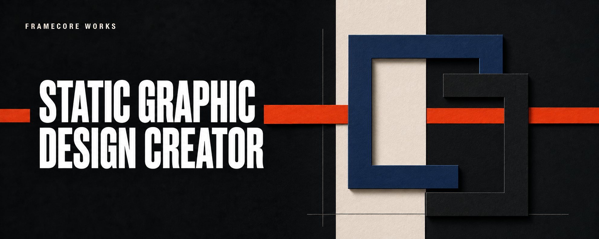

# Static Graphic Design Creator

**Static Graphic Design Creator is a standalone Skill source for ChatGPT Work and Codex.** It turns a creative brief into a finished native render on request or one complete, controlled prompt for static graphics: posters, flyers, business cards, menus, book covers, labels, key visuals, advertisements, and text-led social graphics. For open poster briefs, it first facilitates a goal-led creative discussion before choosing a composition and style direction.

Use this public repository as the versioned source address. The setup below is repository-assisted Skill creation or installation: it does not require downloading a ZIP, cloning the repository, or using a plugin. Updates use a separate, user-initiated comparison and approval flow; this repository is not monitored automatically.

It can create a static graphic through the active surface's built-in image generation when the user explicitly asks for a render. When the user asks for a prompt, it returns the complete prompt without rendering. It is not a DTP tool and marks generator-sensitive limits as `Unknown` when they are not verified.

## Install from this repository

### ChatGPT Work

1. Open a ChatGPT conversation and switch from **Chat** to **Work**.
2. Paste the prompt below. The repository URL is the only source address; `@skill-creator` selects the native Skill-creation flow.

```text
Use @skill-creator to help me create and install the native ChatGPT Skill from this public repository:
https://github.com/FrameCoreWorks/static-graphic-design-creator

First read and follow CHATGPT_INSTALL.md in that repository. Create only the declared `static-graphic-design-creator` Skill from the checked source manifest. This is a Skill, not a plugin.

Keep the setup conversational and follow CHATGPT_INSTALL.md in that repository. Start with its short onboarding before asking for approval. After my clear conversational approval, use the already active @skill-creator workflow to create the one declared Skill from the checked source manifest.

Do not search for a separate tool, command, MCP server, modal, callback, or hidden install button. @skill-creator is the native creation workflow in ChatGPT Work. Mark the Skill installed only after it reports that it created and saved the Skill, or the Skill is visible in the Skills library.

```

ChatGPT Work starts with a short onboarding before requesting approval. It explains what the Skill gives, how it controls a static-design prompt, when it is useful, and its limits around generation, brand facts, raster typography, and DTP.

After approval, ChatGPT Work reads the exact file list from `config/chatgpt-skill-sources.json` and verifies the declared hashes when the active surface supports that check. If hash calculation is unavailable, it must report `hash_verification: unavailable` without claiming verification, then continue from the declared source manifest. It uses the already active `@skill-creator` workflow to create one native personal Skill. The Skill can then be used as `@static-graphic-design-creator`, by asking for a controlled prompt, or by explicitly asking to generate a static graphic. A real creation result, not the approval or the absence of extra UI, determines whether installation succeeded.

### Codex

In a Codex chat, paste:

```text
Install the standalone Skill from this public repository:
https://github.com/FrameCoreWorks/static-graphic-design-creator

Read CODEX_INSTALL.md and install only the declared `static-graphic-design-creator` Skill. Do not clone the repository, create a plugin, or install any unrelated workflow files.
```

The Codex install contract resolves the same release-pinned source manifest and installs the skill as `$static-graphic-design-creator`. No ZIP or manual file copy is required.

## Update an existing installed Skill

Every installation from `v0.5.0` onward carries a source record with its repository, release version, and ref. Paste one of the prompts below when you want to check the repository for a newer release. The update flow first compares manifests and files, reports a `Delta`, and requires approval before changing the existing Skill. It never creates a duplicate or updates in the background.

### ChatGPT Work update

```text
Use @skill-creator to update the existing native ChatGPT Skill from this public repository:
https://github.com/FrameCoreWorks/static-graphic-design-creator

First read and follow CHATGPT_UPDATE.md in that repository. Update only the existing `static-graphic-design-creator` Skill. This is a Skill update, not a plugin, connector, MCP server, ZIP installation, or new duplicate Skill.

Read the latest release-pinned source manifest and compare it with the installed Skill's source-release record and declared source files. Before changing anything, report the installed version, available version, changed files, new files, removed files, unchanged files, local modifications, verification status, and proposed apply mode.

If there are no source changes, report `already_up_to_date` and stop. If there are changes, show `Delta` and ask for my clear approval before replacing any file. After approval, update the existing Skill only. Use `selective_file_update` only when file-level comparison is verified; otherwise report `declared_bundle_replacement`. Never create a second Skill with the same name or apply a background update.
```

### Codex update

```text
Use $skill-installer to update the existing personal Skill from this public repository:
https://github.com/FrameCoreWorks/static-graphic-design-creator

First read and follow CODEX_UPDATE.md in that repository. Update only the installed `$static-graphic-design-creator` Skill. Compare its source-release record and prior release manifest with the current stable source manifest before changing files.

Report the installed and available version, a Delta of changed/new/removed/unchanged files, local modifications, verification status, and proposed apply mode. If no change exists, report `already_up_to_date` and stop. Ask for my explicit approval before applying an update. Do not overwrite a local conflict, create a duplicate, clone the repository into my project, install a plugin, or apply a background update.
```

Pre-`v0.5.0` installations do not yet contain the source record. The update flow treats them as `unrecorded`, asks the user to confirm origin, and then uses the manifest to perform a one-time migration safely.

## What the Skill does

- converts a short brief or a structured workflow handoff into a generator-ready static-design prompt;
- generates a finished static graphic through native image generation only when the user explicitly requests it;
- protects exact visible copy, attention order, layout zones, references, and exclusions;
- separates verified native controls from prompt-semantic controls and post-render QA;
- supports standalone use and optional integration with an existing workflow;
- runs an objective-first poster brainstorm when creative direction is open, while preserving a user's concrete direction when it is already defined;
- chooses composition archetypes, historical visual families, and print-material simulations as disciplined design decisions rather than effect filters;
- treats font fidelity and dense raster text as QA risks rather than guarantees.

By default, the Skill creates one standalone, provider-neutral prompt. Its eight stages describe construction priority inside a single final generation; they do not request intermediate renders, separate layer files, or later text insertion.

When a connected workflow explicitly declares `host_environment: codex`, `execution_surface: codex_builtin_imagegen`, `generator_provider: openai`, a final static graphic with visible text, and `target_generator: gpt-image-2`, the optional compatibility profile formats that handoff as one prompt with exact final copy inside it and integrated constraints rather than a separate negative prompt. The profile alone does not authorize rendering. The separate explicit `render` or `render_and_prompt` mode may invoke `$imagegen` when it is available, never an external service.

## Repository layout

```text
.
├── .agents/skills/static-graphic-design-creator/
│   ├── SKILL.md
│   ├── agents/openai.yaml
│   ├── references/
│   └── templates/
├── config/
│   ├── chatgpt-skills.json
│   └── chatgpt-skill-sources.json
├── CHATGPT_INSTALL.md
├── CHATGPT_UPDATE.md
├── CODEX_INSTALL.md
├── CODEX_UPDATE.md
├── tests/test_skill.py
├── LICENSE
└── README.md
```

`.agents/skills/` is a source layout for Skills. This repository contains no plugin, connector, marketplace, MCP server, app integration, or external provider integration.

## Input contexts and output modes

**Standalone mode** accepts an ordinary brief. Missing generator-sensitive controls remain `Unknown`; the Skill does not invent support for model versions, font files, reference limits, or output settings.

**Connected mode** accepts supplied workflow fields such as `brief_contract`, `direction_contract`, `copy_pack`, `reference_pack`, `asset_manifest`, `qa_requirements`, `target_generator_profile`, and `host_environment`. It preserves supplied locks and returns a portable `prompt_pack` for the caller's existing workflow. It never requires a particular upstream Skill by name.

Independently, `prompt` returns only a copyable prompt, `render` creates a graphic only after an explicit request and available native capability, and `render_and_prompt` returns both. Render status is always distinct from the requested output mode.

## Validate

```bash
python3 tests/test_skill.py
```

The test verifies the standalone Skill structure, source manifest hashes, portable workflow boundary, Codex text-bearing compatibility profile, copy-feasibility gate, objective-first poster direction, anti-slop composition gate, update identity and conflict routing, and required eight-stage static-design contract. It performs no network activity.

## Versioning and update integrity

The stable source manifest is pinned to the versioned release branch `v0.5.0`. Updates are manual and require user approval. The installed `references/source-release.json` identifies the prior release for comparison. When the receiving surface can calculate SHA-256 and inspect installed files, the update contracts compare the prior and target manifests to classify each source file. Selective replacement is allowed only in that verified file-level mode. If comparison is unavailable, the contract reports that limitation and can use only a user-approved exact declared-bundle replacement. If a target hash differs from its manifest, source identity is foreign, or a local modification overlaps an upstream change, the update stops without replacing anything.

## Scope and limits

This Skill may create a graphic only through the active surface's built-in image-generation capability and only after an explicit user request. It does not call external services, select paid tools, upload assets, publish content, or perform DTP. It distinguishes a raster concept or digital final from a `production_master`, which always routes to DTP. For print production, use the rendered output as art direction and verify exact copy, legal text, font licensing, spacing, bleed, and prepress requirements in an appropriate layout tool.

## License

Released under the Apache License 2.0. See [LICENSE](LICENSE).
